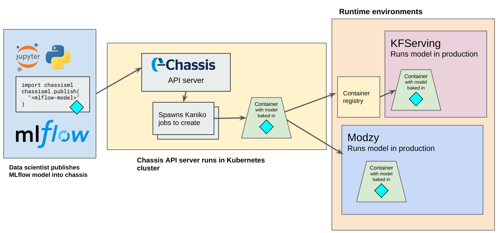
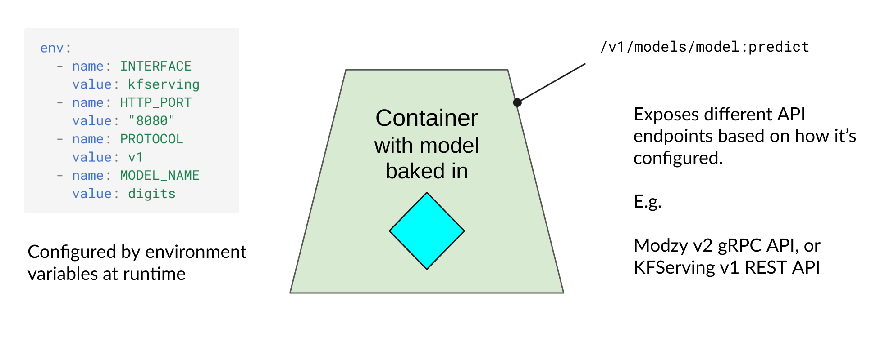

# Design & Architecture

Chassis makes it easy to create a deployable docker image from your trained ML model.

The idea behind this project is to provide Data Scientists with a way to package their models into a Docker image. This image will manage to build the inference service compatible with several common platforms for free.

At the moment, Chassis images are compatible with KFServing and Modzy gRPC. This means you can deploy your built image into these platforms once it has been built.

Deploy Chassis, send your model to it and start using the built container image to run inference on your data.

## Architecture

This diagram shows the overall architecture of the Chassis system:

{ style="border:20px solid white" }

This diagram zooms in on the generated container, showing the pluggable interface, configurable at runtime:

{ style="border:20px solid white" }

## Goals

Chassis is a Kubernetes service that can be deployed in your preferred cluster using Helm. It works by creating jobs that can be run in parallel to create Docker images that package ML models. It provides integration with most common deployment platforms so your model will be ready to be deployed in a simple way.

It also provides a python SDK that makes it very easy to communicate with Chassis service in order to build your image.

**Simple**

- Just make a request to build your image using the python SDK
- Small set of dependencies: mlflow, flask
- Supports multiple deployment platforms
- No DevOps knowledge needed

**Fast**

- Start building the image as soon as you make the request
- Automatically upload the image to Docker Hub
- Image ready to be deployed

**Secure**

- Using [Kaniko](https://github.com/GoogleContainerTools/kaniko/) to securely build the image

## Non-goals

Some non-goals of this project are:

- Deploy the built image - this is up to the platform that you deploy the container into, like KFServing or Modzy
